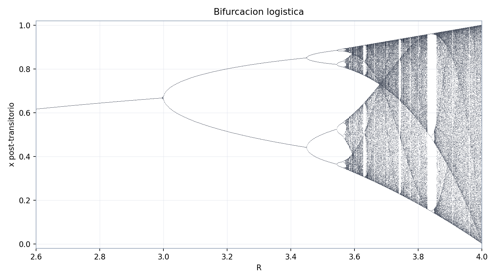
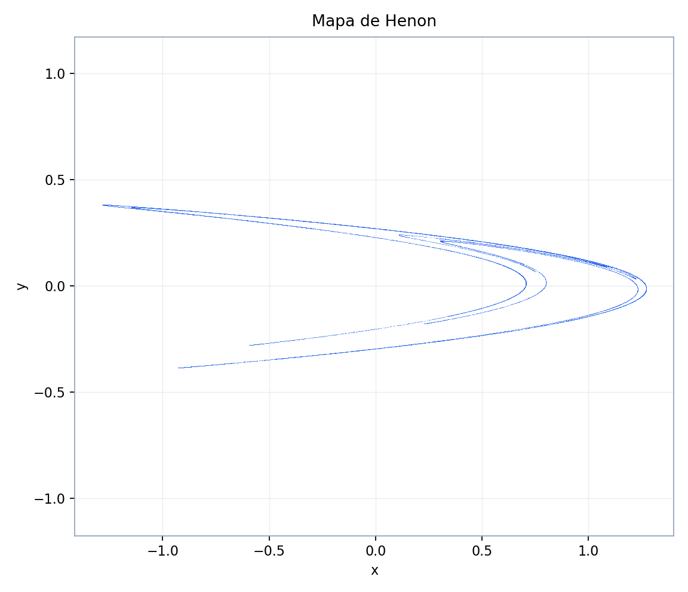
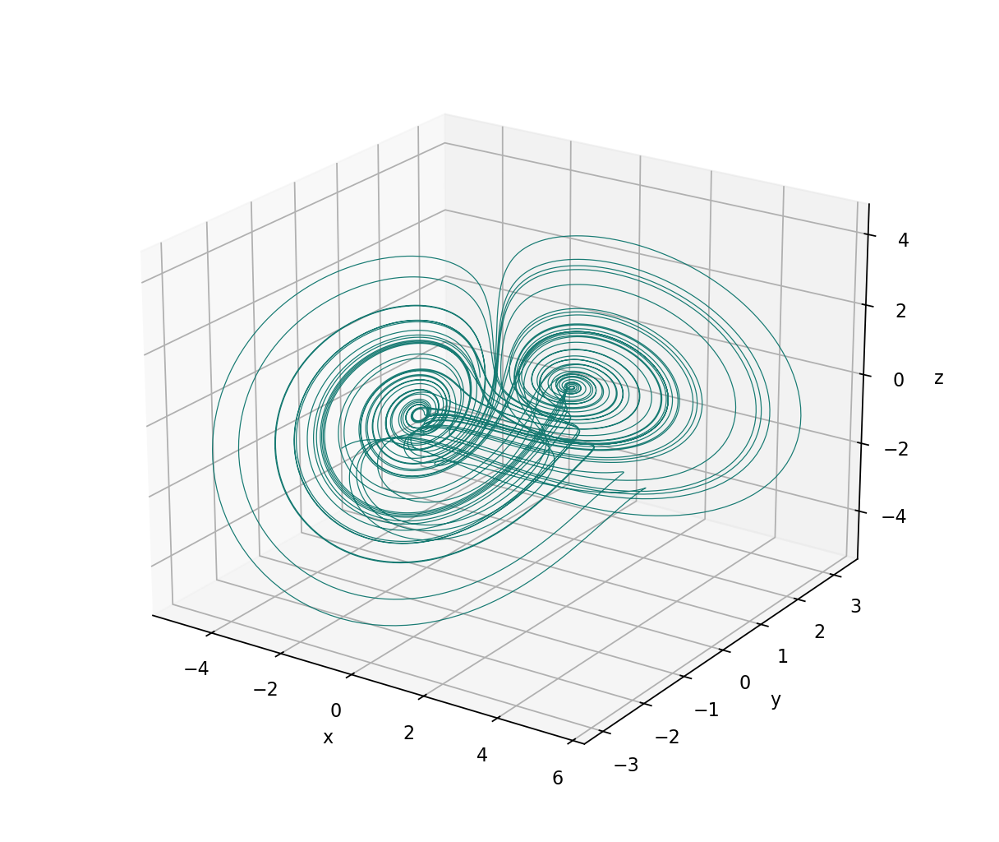

# Explorador Sprott

Esta pagina resume la idea teorica que inspira el Explorador Sprott de Chaos
Toolbox. La referencia principal es el libro de Julien C. Sprott, *Strange
Attractors: Creating Patterns in Chaos* (M&T Books, 1993), junto con el
manuscrito oficial que Sprott mantiene en su sitio de la University of
Wisconsin. El codigo, los ejemplos y las figuras de esta app son una
reimplementacion educativa independiente; no redistribuyen los diccionarios,
programas ni laminas originales del libro.

## Idea central

Sprott presenta el caos como una combinacion de determinismo, sensibilidad a
condiciones iniciales y acotamiento no trivial. Una regla puede ser
completamente determinista y aun asi tener horizonte predictivo corto: dos
estados iniciales casi iguales se separan hasta que la no linealidad limita el
crecimiento y confina la orbita en una region complicada.

$$\lVert x_n-y_n\rVert \approx \lVert x_0-y_0\rVert e^{\lambda n}$$

Para la exploracion computacional esto se traduce en una lectura practica:

- no basta con que la figura sea bonita;
- no basta con que la trayectoria sea irregular durante pocos pasos;
- un candidato util debe estar acotado, no colapsar a punto fijo o ciclo corto,
  y conservar ecuaciones, codigo, parametros, transitorio y diagnosticos.

## De reglas simples a formas complejas

El libro insiste en que sistemas muy simples pueden producir estructuras
visuales complejas. El primer ejemplo didactico es la ecuacion logistica:

$$x_{n+1}=R x_n(1-x_n)$$

Al variar $R$, la orbita pasa de punto fijo a ciclos periodicos, duplicaciones
de periodo y regiones caoticas con ventanas periodicas. Por eso esta pagina usa
la bifurcacion logistica como primer ejemplo: muestra que una sola ecuacion
cuadratica ya contiene la ruta basica de orden a caos.

## Mapas polinomiales

Un mapa discreto calcula directamente el siguiente estado:

$$x_{n+1}=F(x_n), \qquad F_i(x)=\sum_j c_{ij}m_j(x)$$

En dos dimensiones, cada iteracion produce un punto del plano. La no linealidad
puede contraer areas en unas direcciones y estirar en otras, generando objetos
que tienen mas detalle que una curva simple pero no llenan todo el plano. Esa
lectura es la base del flujo de trabajo de la app: decodificar coeficientes,
iterar, descartar transitorios y mirar la proyeccion post-transitorio.

## Flujos polinomiales

Un flujo continuo define derivadas:

$$\dot{x}=F(x), \qquad x(t+h)\approx x(t)+hF(x(t))$$

El capitulo de campos y flujos del libro conecta esta idea con Lorenz y
Rossler, y el epilogo propone buscar ejemplos simples de caos en EDO
polinomiales. Como ejemplo teorico, Sprott da un sistema 3D de cinco terminos:

$$x'=yz, \qquad y'=x-y, \qquad z'=1-xy$$

La grafica siguiente se genero desde esas ecuaciones con RK4. Es una figura
educativa propia de esta app, no una reproduccion de una lamina del libro.

## Codigos compactos

El programa historico de Sprott codificaba familias de ecuaciones y
coeficientes en cadenas compactas. Chaos Toolbox conserva esa idea como
interfaz educativa: la primera letra selecciona familia, dimension, tipo y
orden; las letras siguientes se leen como coeficientes.

$$c=\frac{\mathrm{ord}(\mathrm{letter})-77}{10}$$

En esta reimplementacion:

- `M` representa `0.0`;
- letras antes de `M` dan coeficientes negativos;
- letras despues de `M` dan coeficientes positivos;
- las familias `A-X` cubren mapas y flujos polinomiales;
- las familias especiales `Y`, `[`, `\\`, `]`, `^` implementan funciones no polinomiales (valores absolutos, potencias de valores absolutos, senos, rotación, oscilador forzado);
- la familia especial `Z` (lógica AND/OR) permanece documentada pero pendiente de validar su semántica exacta.

## Busqueda automatica

El patron de busqueda de Sprott es experimental: generar muchas reglas simples,
simularlas, descartar las triviales y estudiar las candidatas. En esta app el
boton **Buscar candidato** aplica filtros rapidos:

- rechaza trayectorias divergentes o con valores no finitos;
- rechaza colapso a punto fijo;
- marca como baja complejidad las colas con poca dispersion o muchos estados
  repetidos;
- etiqueta como `candidate_chaotic` solo a una trayectoria acotada y no
  colapsada.

Esa etiqueta no es una demostracion de caos. Para afirmar caos hacen falta
diagnosticos mas fuertes, por ejemplo exponentes de Lyapunov, espectro,
secciones, dimension y pruebas de sensibilidad con integracion mas larga.

## Como generar estas graficas

Desde la raiz del repositorio:

`python assets/sprott/generate_theory_figures.py`

El script escribe las imagenes en `assets/sprott/images/` y usa parametros
fijos para que la pagina sea reproducible. Despues abre la pestana
**Explorador Sprott > Teoria** para verlas dentro de la app.

## Referencias

Sprott, J. C. (1993). *Strange Attractors: Creating Patterns in Chaos*. M&T
Books.

Sprott, J. C. (1993). *Strange Attractors: Creating Patterns in Chaos*,
manuscrito oficial en linea, University of Wisconsin:
https://sprott.physics.wisc.edu/fractals/booktext/SABOOK.HTM

Sprott, J. C. *Sprott's Fractal Gallery*, University of Wisconsin:
https://sprott.physics.wisc.edu/FRACTALS.HTM

Sprott, J. C. (1994). Some simple chaotic flows. *Physical Review E*, 50,
R647-R650. DOI: 10.1103/PhysRevE.50.R647.
